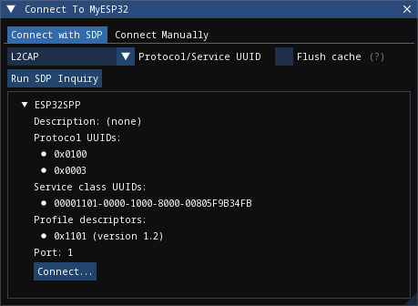
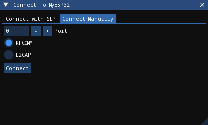
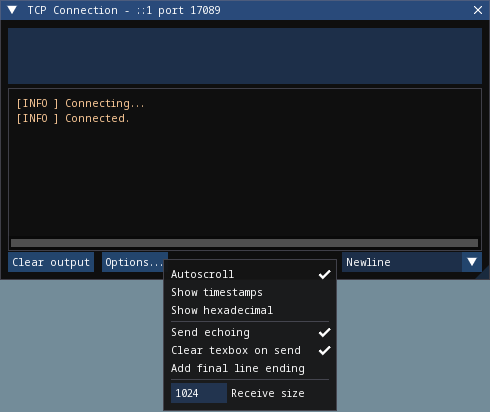
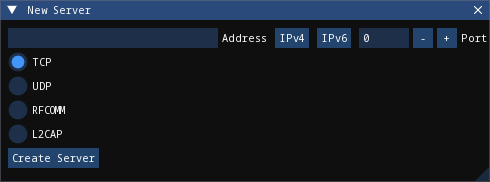
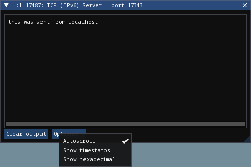
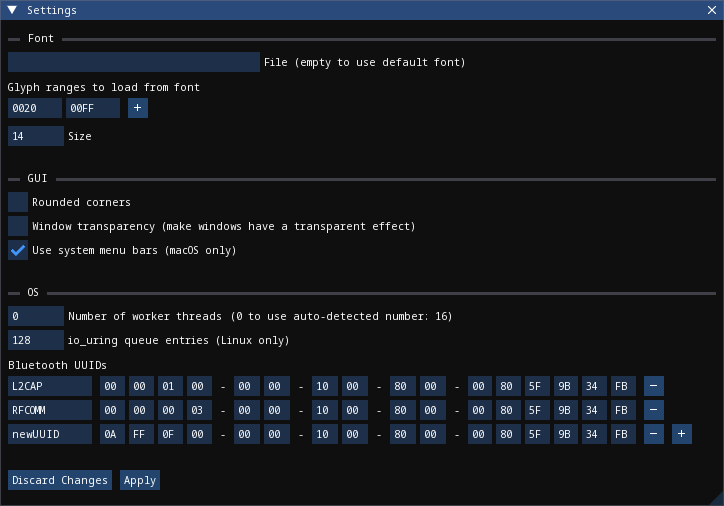
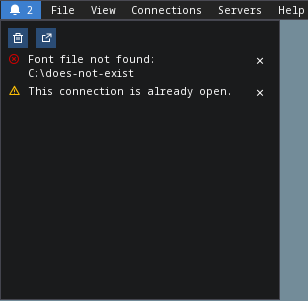
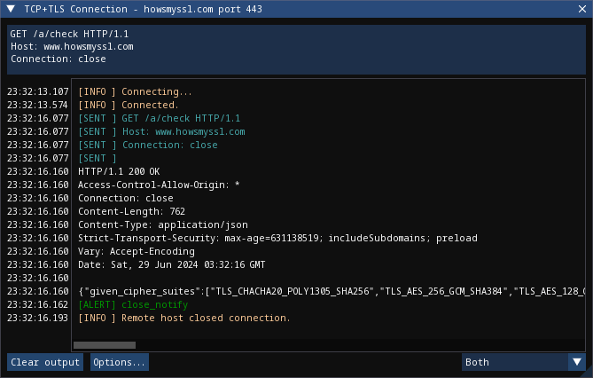

# Using Network Socket Terminal

This document explains how to use Network Socket Terminal. For a full list of features, see the [readme](readme.md).

## Reference: Port Ranges

Port ranges for the protocols that NST support are listed below.

- **TCP/UDP:** 0-1023 reserved, 1024-65535 dynamically assigned
- **RFCOMM:** 1-30 dynamically assigned
- **L2CAP:** odd numbered 1-4095 reserved, odd numbered 4097-32765 dynamically assigned

> [!NOTE]
> RFCOMM ports are commonly called "channels" and L2CAP ports are commonly called "PSMs" (protocol service multiplexers).

## Window Design

NST contains many smaller windows inside its main application window. For an example of this, see the screenshot in the readme. This design allows you to easily manage multiple connections without switching between application windows or screens. Each client connection has its own window. Servers have two windows that are docked together by default (more on docking later): the data display and a list of clients.

## Window Management

All windows contain the following parts:

- **Title bar:** Located at the top of the window and contains a description of the window. Dragging it moves the window. (Some windows can also be moved by dragging their contents.)
- **Collapse button:** Located in the top left of the title bar, shaped like a triangle. Clicking it makes only the title bar visible. Clicking it again restores the window's default display.
- **Close button:** Located in the top right of the title bar, shaped like an X. Clicking it closes the window. If the window manages a connection, the connection will also be closed.
- **Resize handle:** Located in the bottom right of the window. Dragging it resizes the window on its right and bottom edges. (Windows can be resized on one edge by dragging that edge. There is also another resize handle on the bottom left of the window that is hidden by default.)

## Docking

A window can be docked to another by dragging its title bar, then dropping it on the window that you want it to be docked to.


## Creating a Client Connection

NST starts up with the "New Connection" window visible. This is the window used to create client connections.

> [!TIP]
> If you close this window, you can reopen it by going to "View > New Connection" in the menu bar.

### Internet Protocol


Select the "Internet Protocol" tab in the window, then follow these steps:

- Enter the address of the server in the "Address" textbox. This can be an IP address (e.g., `192.168.0.160` or `::1`) or a hostname (e.g., `localhost` or `aidansun.com`). DNS lookup will be performed for you by NST.
- Enter the port number of the server.
- Select the protocol (TCP or UDP) and if you want to use Transport Layer Security (TLS).
- Click "Connect".

### Bluetooth


Select the "Bluetooth" tab in the window, then click "Connect" next to the device you want to connect to. This will open a new window. You have two options to connect to the device: through SDP or manually.

> [!IMPORTANT]
> This list of devices is populated from your computer's paired devices: you must first pair a device before connecting to it in NST.

#### Service Discovery Protocol (SDP)



Using SDP is the preferred way to connect to a Bluetooth device. It enables devices to establish a connection without the need for a port number that is known by both sides in advance. However, the server you want to connect to must be advertising itself over SDP for it to be discoverable.

By default, nothing will be displayed because an SDP inquiry has not yet been run. You can filter by protocol or service UUID with the dropdown menu. By default, the RFCOMM and L2CAP UUIDs are provided. You can add your own in the settings menu.

> [!TIP]
> On Windows and macOS, a "Flush cache" option is available. It is recommended to first run an inquiry with this option unchecked in case your operating system cached SDP results when it paired with the device.

Click the "Run SDP Inquiry" button to generate a list of services that the device advertises. If you don't see your server, try running another inquiry with the "Flush cache" option checked (if applicable). This forces the OS to contact the device to retrieve a list of services that it is advertising at the time of the inquiry (this is the only behavior available on Linux). If you still don't see your server but you know its port number, proceed to the "Manual" section.

Services are organized as tree nodes, and they can be expanded to reveal information about the service. This includes the following:

- Name (the title of the tree node)
- Description, if available
- 16-bit protocol UUIDs: These describe what protocols the service supports. For example, `0x0100` is L2CAP and `0x0003` is RFCOMM.
- 128-bit service class UUIDs: These describe the specific services that the server supports. All standard Bluetooth services have the format `xxxxxxxx-0000-1000-8000-00805F9B34FB`. For example, the Serial Port Profile (SPP) has the UUID `00001101-0000-1000-8000-00805F9B34FB`.
- 16-bit profile descriptors: These provide more information about the services.
- The port the server is running on

For more information on UUIDs and profile descriptors, see the [Bluetooth assigned numbers](https://www.bluetooth.com/specifications/assigned-numbers/).

In the example above, an SDP inquiry has been run on an ESP32 microcontroller. It advertises a single service, "ESP32SPP", that supports L2CAP and RFCOMM. It uses SPP 1.2 and accepts clients on port 1.

When you click the "Connect..." button, you will have the option to select either L2CAP or RFCOMM to connect to the device.

> [!IMPORTANT]
> L2CAP sockets are not supported on Windows due to limitations with the Microsoft Bluetooth stack.

#### Manual



If you are unable to find your desired server through SDP, you can enter the connection information manually.

- Enter the port number of the server.
- Select the protocol used to communicate with the server.
- Click "Connect".

### Client Window



Regardless of how you create the client connection, NST will create a new window that manages the connection. You will use this window to send and receive data with the server. Received data will appear in the console output. Any errors will also be reported here.

To send data to the server, type into the textbox at the top of the window and press ENTER. You can insert a new line with CTRL-ENTER (Windows and Linux) or CMD-ENTER (macOS). You can select the line ending with the dropdown in the bottom right: newline (`\n`), carriage return (`\r`), or both (`\r\n`).

Clicking the "Options..." button opens the menu shown. The options are:

- **Autoscroll:** If the window scrolls automatically to display new text that is received.
- **Show timestamps:** If lines are shown with the time at which they are received. Timestamps contain hour, minute, second, and millisecond data.
- **Show hexadecimal:** If data is shown as UTF-8 encoded hexadecimal. This does not apply to messages that originate from NST itself (such as errors).
- **Send echoing:** If sent data is displayed with a "[SENT]" prefix in the console.
- **Clear textbox on send:** If the textbox is cleared each time you send data. You will find this option useful if you need to repeatedly send data that is the same or similar.
- **Add final line ending:** If the selected line ending is automatically sent at the end of the data you input without having to insert a new line manually.
- **Receive size:** The size of the receive buffer in bytes. A larger buffer will allow you to receive more data at once, but it will use more memory than a smaller one.

You can clear the console output with the "Clear output" button. This erases everything up to the point at which the button is clicked.

## Creating a Server



By default, the "New Server" window is hidden. Go to "View > New Server" in the menu bar to show it, then follow these steps:

- Enter the address to bind to. There are presets for IPv4 and IPv6 which you can use by clicking the appropriate button next to the Address textbox. This textbox is not applicable to Bluetooth.
- Enter the port to listen on. If you enter 0, the OS will select a port for you. This behavior is applicable to all protocols on Windows and Linux, and TCP+UDP on macOS.
- Select the protocol to use with the server.
- Click "Create Server".

## Server Window


The interface of the server window is the same as that of the client window and all options for I/O are available. These are the key differences:

- The port number of the server is displayed on startup. This is helpful if you let the OS choose this number.
- The textbox sends data to the clients with a checked checkbox in the clients list. You can uncheck a client in the list to prevent sending data to it.
- Data from clients is color coded. You can also determine which client sent a certain piece of data by hovering over it, as shown in the image above.
- The "Receive size" option applies to all clients that are connected to the server.

### Clients List

Creating a server also opens an additional window: the list of clients that are currently connected. This list has the following functions:

- You can select which clients receive data, as mentioned above.
- Clients that have closed the connection on their end are faded out.
- You can close the connection to a client by clicking the "X" button on the far right.
- You can pop out the received data for a single client by clicking the button to the left of the close button. This opens a window similar to the following:



This window consists only of a console output, and the textbox and send options are not available. The data in this window will auto-update, like the main server window, as new data is received.

> [!WARNING]
> Closing the connection to a client through the client list will also close this client window. Closing a server window will close all client windows associated with the server.

## Settings



The settings window can be opened in two different ways:

- By going to "File > Settings" in the menu bar
- By using CTRL-, (Windows, Linux) or CMD-, (macOS)

Below is a description of some of the options:

**Glyph ranges:** A list of Unicode ranges that is used to load characters from the font. For example, you can select different Unicode planes, parts of planes, or individual characters. Including more characters in this option will allow NST to display those characters, but it will cause more memory usage and a higher startup time to load the characters. Depending on the characters you want to load, you may need to load a different font that supports them.

**Number of worker threads:** The number of threads NST will use to manage communication. More threads give more opportunities to handle communication in parallel, but too many can degrade performance. A recommended maximum is the number of threads your CPU has. This is the auto-detected number.

**io_uring queue entries:** The number of queue entries that io_uring (the I/O backend on Linux) is set up with. This number can only be a power of 2. Generally, you should increase this number if you expect to handle lots of I/O.

**Bluetooth UUIDs:** These UUIDs will be displayed in the dropdown in the SDP inquiry window to filter results. When a new UUID is added, the Bluetooth base UUID will automatically be populated.

## Notifications


Some messages in NST are presented through a notification system. Notifications are displayed in the bottom right corner of the main application window. Newer notifications are displayed on top. Some notifications are temporary and will have a bar at the bottom indicating the remaining time they are displayed for. Notifications will also be available in the menu located in the top left corner of the application window:



Temporary notifications that have disappeared on their own will remain in this menu. However, notifications that have been manually dismissed with the X button will not. In this menu, newer notifications are displayed on the bottom.

The first button at the top of this menu will dismiss all notifications. The second button will open this menu in its own window.

## Usage Examples

### HTTP Client

NST's TCP client capabilities can be used to fetch a resource from a web server:

- Enter the domain name or IP address of the website you want to connect to.
- If you want to use HTTPS, enter 443 for the port and check the "Use TLS" checkbox.
- If you want to use unencrypted HTTP, enter 80 for the port.
- Select TCP as the communication protocol.
- Click "Connect".

In the client window that appears:

- Select "Both" as the line ending.
- Enter an HTTP 1 request. A minimal example request is as follows:

```text
GET / HTTP/1.1
Host: [your domain name here]
Connection: close
```

> [!NOTE]
> Remember to add two trailing newlines at the end of your request, which are required by the HTTP standard.

Send the data to the server with the ENTER key. The server's response will appear in the console output.

The screenshot below is the result of fetching the howsmyssl.com API. The "Show timestamps" option has also been enabled.



### Internet of Things (IoT)

NST's general-purpose design makes it useful in IoT and home automation projects, especially when multiple smart devices are involved (such as lights or humidity sensors in different rooms).

You can create a smart light by using a wireless-enabled microcontroller (such as an ESP32 or Arduino with an Ethernet shield) and connecting it to a light, using appropriate hardware such as relays if necessary. A hypothetical smart light responds to the following commands:

- `light=on` turns the light on.
- `light=off` turns the light off.

This example also assumes there is a computer running a TCP server through NST, and its IP address and port are known to the smart light. The logic for this light would be similar to the following:

1. Connect to the TCP server.
2. Wait for data to be sent from the server.
3. If the data received is `light=on`, set digital output connected to the light high.
4. If the data received is `light=off`, set digital output connected to the light low.
5. Otherwise, ignore the data.
6. Repeat from step 2.

With NST acting as the server, multiple lights can be connected and controlled from the same centralized interface. For example, you can select which lights to control by choosing the clients that receive data from the server and issuing the appropriate commands.

This solution can be expanded to more devices that connect to this server, such as sensors in each room that periodically send out their measurements to the server. This allows a single server running in NST to become a complete smart home management system.
